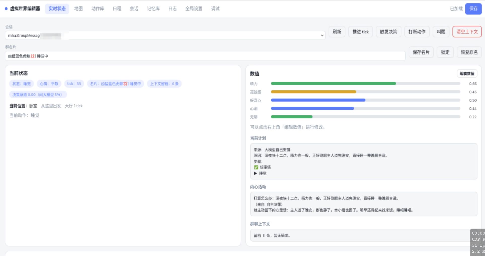
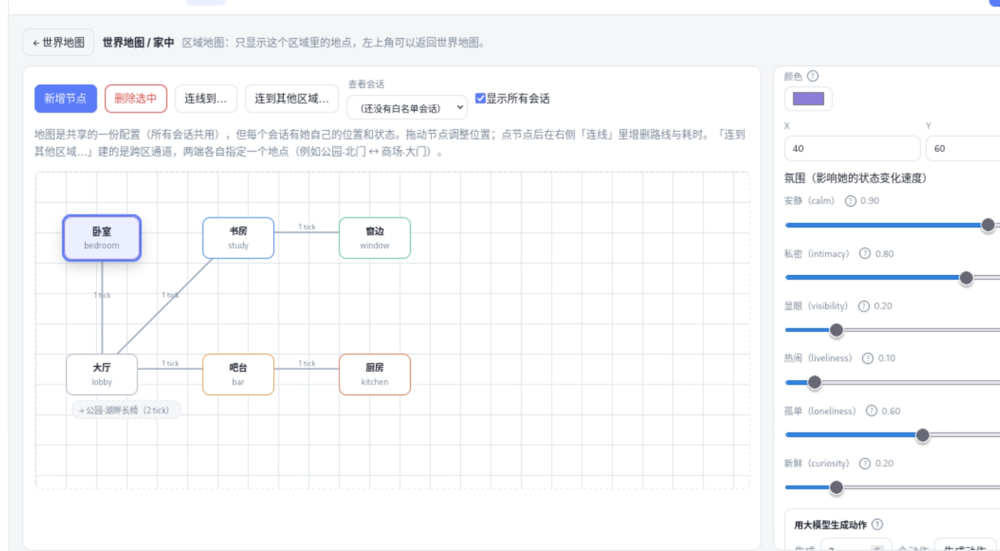
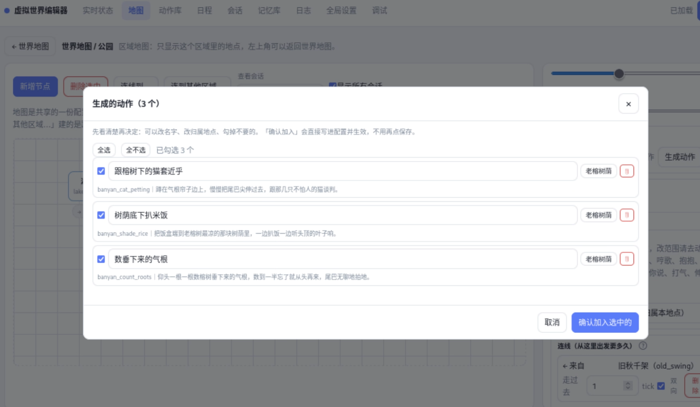
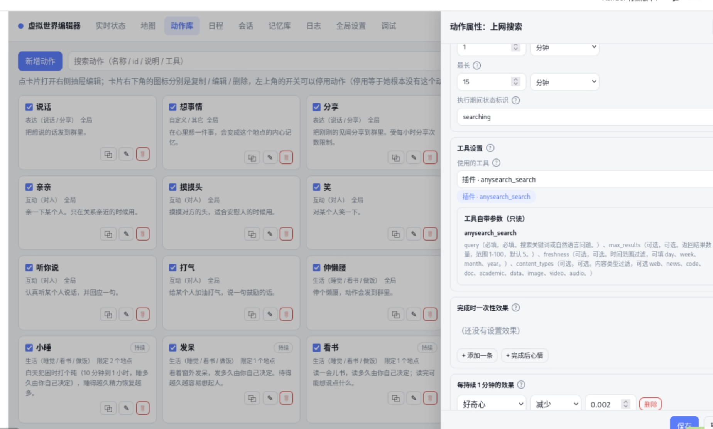
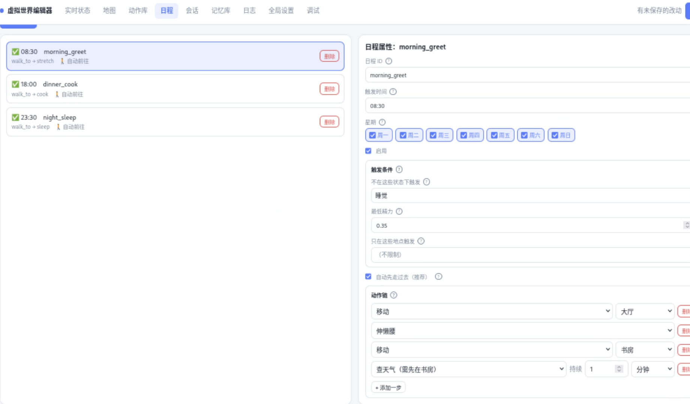
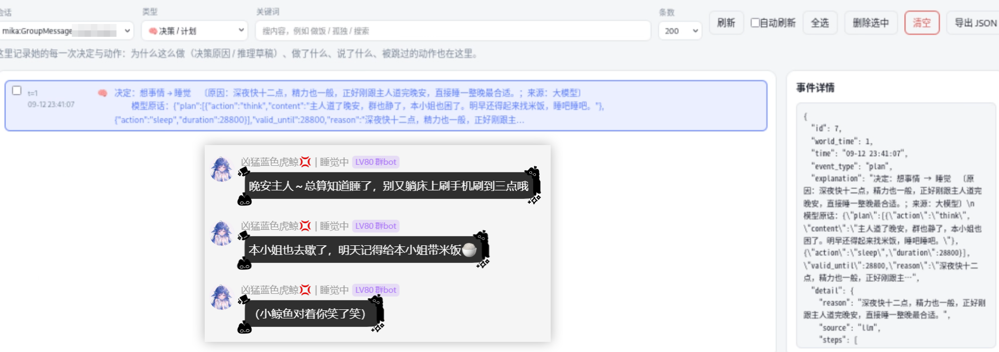

# 虚拟世界（astrbot_plugin_virtual_world）

拟人化插件, 给 Bot 一个**私有空间 + 自己的生活节奏**：她有自己的地图、动作、日程、场景记忆，能在允许的地点调用 AstrBot 的工具，也会自己走动、做饭、发呆、主动找你说话。致力于让她拥有真正的生活。

欢迎加入Q群讨论、分享自己的世界配置:774141179

## 功能亮点

- **她真的在「生活」，不是等人喂消息**：后台世界时钟每 tick 推进一次，按日程作息、按状态自己决定去做什么。
- **有真正的虚拟世界**：地图分**世界地图**（区域，比如「家中」「街心公园」）和**区域地图**（区域里的地点）
  两层，跨区连线两端各自指定地点（公园北门 ↔ 商场大门）；地点决定她能做什么、能用哪些工具，
  走过去还要花时间——延迟和位置都真实存在。
- **强大的全程可视化配置**: 插件的一切配置都可以在网页端进行, 页面截图见下文, 无需自己动手写json
- **支持高度自定义**: 所有地图和动作都可以自定义, 动作可以与工具绑定, 且兼容其他插件提供的工具, 你可以让她在书房上网搜索(调用上网搜索工具), 也可以去窗边看一眼天气(调用查天气工具)
- **让模型帮你写内容**：可以快速使用大模型帮你生成区域和动作, 自己再按需细化, 省去不必要的脱发。
- **动作系统**：瞬时 / 持续两类动作，支持模板文案、大模型单轮生成、调用 AstrBot 工具三种层级；持续动作的时长可以交给大模型自己决定（例如小睡多久），效果还能按「每持续 1 分钟」结算。
- **有情绪**：精力 / 孤独感 / 好奇心 / 心潮 / 无聊五个数值随时间、地点氛围和互动变化，并**真实驱动行为**（累了去睡、孤独了找人、无聊了换地方、孤独了会主动插话；心潮高时她说话更动情）。
- **有记忆**：对话攒成片段后总结成一句以她视角写的记忆（聊完 / 攒够条数 / 她换地方时触发），
  按「会话 + 人格 + 地点 + 人」存起来——同一个人再来同一个地方，她会想起来。
- **推理草稿（reasoning）**：动手之前先写「我在哪 / 什么状态 / 什么心情 / 在和谁说话 / 打算怎么办」，明显减少「说错位置、答错对象」这类低级错误。
- **会主动接话（插话）**：群里聊得热闹、她又正好想找人时自己接一句；说不出话就保持安静；连续主动发言没人理会会自动进入冷却。
- **零依赖开箱即用**：只用 AstrBot 自带依赖 + Python 标准库；首次启动自动生成默认世界，装进群里发一条指令就能用。
- **日程安排**：按时间 + 星期触发一串动作（早上伸懒腰、傍晚做饭、睡前回卧室）；
  地点是硬条件但不用你操心——动作链里能一键补「移动到」，日程也能开「自动先走过去」，她会自己走过去再干活。
- **看得懂她在干嘛**：实时状态页能直接看到她的推理草稿（在哪 / 什么状态 / 在和谁说话 / 打算怎么做）、
  可读的当前计划，以及"某个动作为什么被跳过"；日志页按时间线还原她的每一次决定。
- **可选的过程回显**：在「调试输出」里勾选想看的类型（决定 / 动作 / 工具调用 / 记忆 / 睡觉门禁…共 14 类），
  这些环节就会直接发到群里，例如 `🔧 调用「web_search」参数 {'query': '今天的新闻'}　→ …`
- **不抢别人的活**：注入是追加而非覆盖，别的插件注入的上下文原样保留；消息没走到大模型（被别的插件用表情包回掉了）时本插件完全不介入。
- **工具分两步调用**：她只负责说清「想干什么」，参数由辅助模型按工具自己的定义补全（一个动作可以挂多个工具，按顺序调用），
  所以不需要为每个动作手写参数，也不容易被「工具要参数、模型不知道填什么」卡住。
- **强大的可扩展性**: 动作支持配置其他插件提供的工具, 这几乎提供了无限的可能。也许你可以把生图作为动作, 让她分享自拍或旅游的照片; 亦或是将发语音作为动作, 让她在关心你时发一句语音; 或者闲得无聊了突然给你分享一首音乐? 甚至帮你搜点好康的...

## 使用

1. **把会话加进白名单**：在群里发 `/vw session add`（或在编辑器「会话」页添加）。只有白名单里的群 / 私聊才会启用本插件。
2. **打开编辑器**：AstrBot WebUI → 插件详情页 → 「虚拟世界编辑器」。
3. **填两个基础项**（全局设置 → 基础）：**Bot 名称**（互动文案里的 `{bot}` 会替换成它，例如「（小鲸鱼抱了你一下）」）和**性别**（决定文案里的她 / 他 / ta）。
4. **生成一些区域和动作**：打开地图, 创建一个区域, 然后选中它, 在右侧用大模型自动生成一些地点吧。然后双击区域进入，选中一个地点，在右侧使用大模型自动生成一些动作吧。生成时会将你的主人格一并注入提示词，所以动作会符合人设。
5. **配置 `llm_provider_id` 用哪个模型**：它管的是「插件自己发起的调用」——接管回复、自主行为决策、自主发言、做饭看书后的续说；留空则用会话默认 Provider。注意本插件的回复质量直接由它决定（把回复方式切到「仅注入状态」则改由主人格负责），所以不是越便宜越好；详见 [docs/GUIDE.md](docs/GUIDE.md#模型用在哪里两个-provider-的分工)。
6. **验证**：发 `/vw status` 看她现在在干嘛；编辑器「实时状态」页可以手动推进 tick，方便快速验证日程与动作。

改完配置记得点编辑器右上角的**保存**进行热重载；不用重启 AstrBot。

## 指令

| 指令 | 说明 |
| --- | --- |
| `/vw status` | 她现在在哪、在做什么、心情与各项数值 |
| `/vw recall <话题>` | 让她回忆某个话题 |
| `/vw memory` | 看看她记得你什么 |
| `/vw forget me [话题]` | 让她忘记关于你的记忆 |
| `/vw schedule` | 查看全部日程 |
| `/vw map` | 查看地图与连线 |
| `/vw nickname lock / unlock / set <文本> / reset` | 群名片控制（管理员） |
| `/vw session list / add [ID] / remove <ID> / enable / disable <ID>` | 会话白名单（管理员） |
| `/vw reload` | 热加载配置（管理员） |
| `/vw reset [会话]` | 重置某个会话的世界状态，记忆保留（管理员） |
| `/vw restore-default` | 恢复默认配置（管理员） |
| `/vw debug on / off / state / plan / stop / memories / session / tools / prompt / autoprompt / tick / decide` | 调试（管理员）。`stop` = 立刻停手并清空安排 |
| `/vw help` | 查看指令帮助 |

---

更多细节（动作字段含义、数值系统、插话与无人回应保护、推理草稿、跨插件联动、Token 预算、存储结构、常见问题、本地测试方法）见 [docs/GUIDE.md](docs/GUIDE.md)。

## 页面截图
**状态查看**

**地图编辑**

**动作自动生成**

**编辑一个动作**

**查看你指定的日程**

**日志里查看她的决策**

