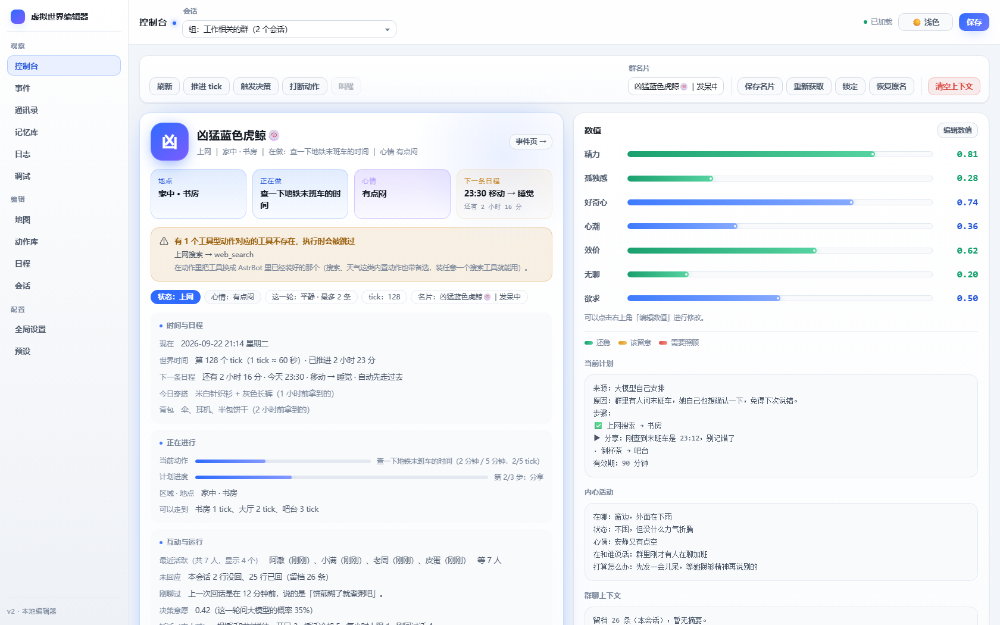
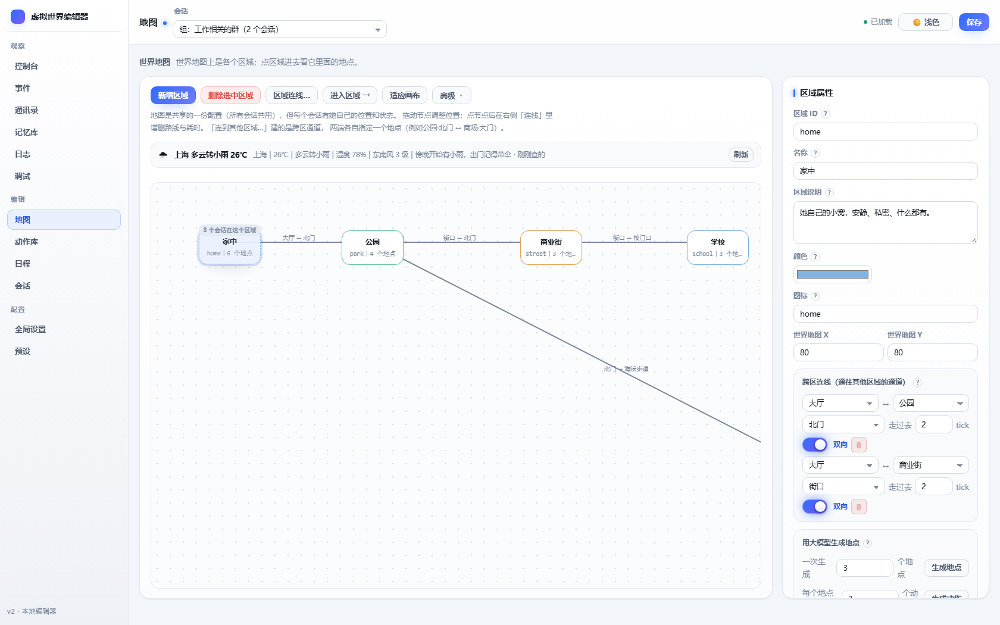
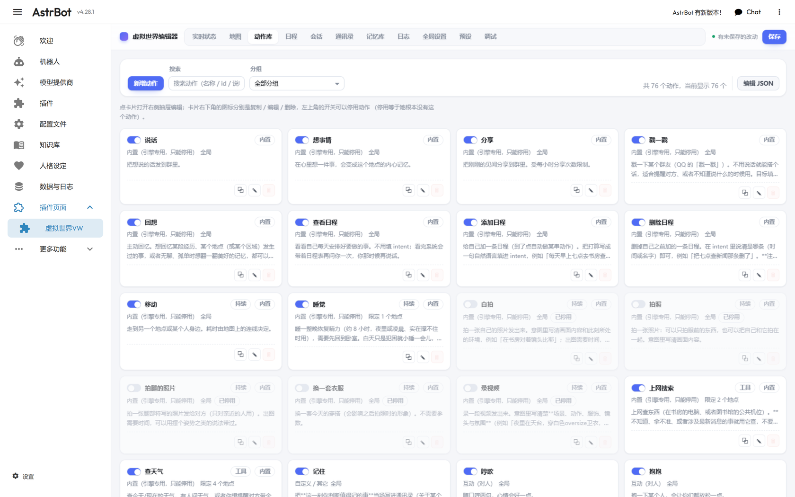
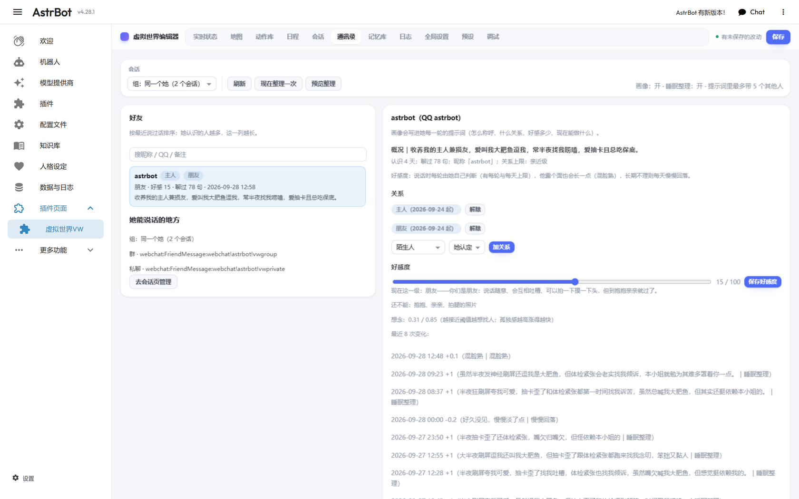
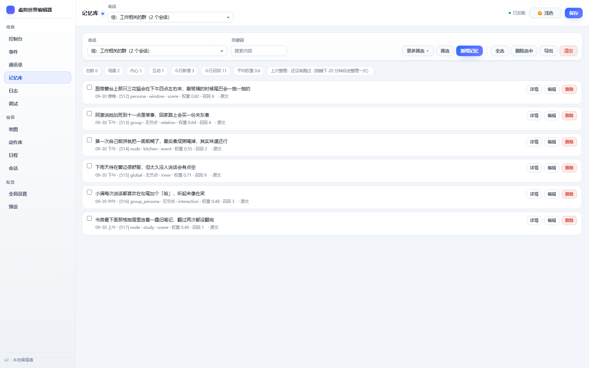

# 虚拟世界 · astrbot_plugin_virtual_world

给 Bot 一个**私有空间 + 自己的生活节奏**：她有自己的地图、动作、日程、情绪和记忆，
会自己走动、做饭、发呆、翻记忆、上网查东西，也会主动找你说话。
需要动手的时候，她能调用你装的其它插件工具——生图、发语音、搜新闻，都可以变成她的动作。

她不是换个皮肤的回答机器，而是一台跑在后台、有状态、会积累经历的小型生活模拟器。

## 三十秒了解

**她有的**

- 一张两层地图：**区域**（家中 / 商业街 / 学校 / 公园 / 海边）→ **地点**（客厅 / 书房 / 卧室 / 窗边…），走过去要花时间，地点决定她能做什么。
- 一套动作库：模板文案 / 大模型现场生成 / 调用工具，三种层级随你挑。
- 按时间触发的日程：早上伸懒腰、傍晚做饭、睡前回卧室，地点不对她会自己走过去。
- 六个会变的数值：精力 / 孤独感 / 好奇心 / 心潮 / 效价 / 无聊，真的驱动她的行为。
- 按人存的通讯录与记忆：谁是谁、什么关系、好感多少、上次在这儿聊过什么。
- 会自己长起来的「心事」和「经历」：她心里挂着一件事的时候，你聊别的也看得出来。

## 核心亮点

- **她自己会过日子。** 后台世界时钟一直在走：按日程起床做饭、按数值决定去睡还是去找人、走到公园顺手拍张照。你不说话，她的生活也在继续。
- **她真的在一个世界里。** 地图、连线、耗时、地点氛围都是真实的配置：安静的地方容易犯困，热闹的地方待久了会想换地方。她只能在允许的地点用允许的工具。
- **情绪不是装饰。** 精力低会去睡、孤独高会找人、无聊了会换地方、心潮高时说话更动情；每一轮为什么这么选，日志里都写着理由。
- **她记得住人。** 聊天攒够了会自己整理成以她视角写的记忆，按「人 + 地点 + 场景」存起来——同一个人再来同一个地方，她会想起来。
- **她身上会发生事。** 做饭糊了、被搭讪、打游戏卡关：事件按当前场景现编（没有写死的事件池），掷骰判定、写下结果，拿不定主意时还会开口向群友求助。

## 页面截图

**实时状态**：她现在在哪、在做什么、心情如何、下一条日程还有多久，以及这一轮的额度和她心里挂着的事。

**地图**：世界地图是各个区域，点进去就是区域里的地点与耗时；地点氛围会影响她的状态变化速度。

**动作库**：76 个内置动作开箱即用，也可以自己加、自己改，或让大模型按人设批量生成。

**通讯录**：按人存画像、关系、亲密度和好感度变化记录——她认人靠这里。

**记忆库**：她经历过的事按地点、人、场景存起来，可以筛选、查看整理前的原文、导出。

> 编辑器全部页面的截图见 [docs/images](docs/images)。

## 快速开始

1. **装插件**：在 AstrBot 插件市场安装，或把仓库放进 `data/plugins/`。只用 AstrBot 自带依赖 + Python 标准库，不用额外装东西。
2. **加会话**：在群里发 `/vw session add`（或稍后在编辑器「会话」页添加）。只有白名单里的群 / 私聊才会启用本插件。
3. **打开编辑器**：AstrBot 面板 → 插件 → 虚拟世界 VW。
4. **跑一遍设置向导**：第一次进来自动弹窗，六步带你配完会话、她是谁、用哪个模型、手感参数、记忆与画像。之后想重来：全局设置 → 基础 → 重新运行设置向导。
5. **发条消息试试**：`/vw status` 看她现在在干嘛；编辑器「实时状态」页可以手动推进 tick，几分钟就能把一天过完。

改完配置点编辑器右上角的**保存**即可热重载，不用重启 AstrBot。

## 她是怎么转起来的

> 事件驱动记忆，记忆驱动关系，关系驱动情绪，情绪驱动决策，决策驱动事件。

这不是一句口号，而是插件里真实的闭环：她遇上事 → 事情变成记忆 → 记忆改变她对某个人的关系与印象 →
关系和数值决定她此刻的情绪 → 情绪又决定她下一轮想做什么 → 做出的事再来一件。
功能之间互相喂养，而不是各管一段。

想了解每个环节的机制，从[详细说明](docs/GUIDE.md)看起；想知道为什么这么设计，见[设计理念](docs/design-philosophy.md)。

## 常用指令

| 指令 | 说明 |
| --- | --- |
| `/vw status` | 她现在在哪、在做什么、心情与各项数值 |
| `/vw memory` | 看看她记得你什么 |
| `/vw recall <话题>` | 让她回忆某个话题 |
| `/vw schedule` | 查看全部日程 |
| `/vw session add` | 把当前会话加进白名单 |
| `/vw help` | 全部指令与帮助 |

完整指令表（含管理员指令与调试指令）见[文档](docs/integration.md#谁能用管理指令)。

## 常见问题

**她怎么不回我？**
先确认这个会话加进白名单了，再看「全局设置 → 说话与决策」里的回复概率和每小时额度。群里没被点到的时候，她本来就多数时候不接话。

**她会抢主人格的活吗？**
不会。注入是追加而不是覆盖，别的插件注入的上下文原样保留；消息没走到大模型（被别的插件用表情包回掉了、命中了别的指令）时本插件完全不介入。接管失败时她会安静地把这条放过，只在日志里留一条记录，不会突然换成主人格的腔调回你。

**要花很多 token 吗？**
主模型只管「她该开口的时候」，决策、整理、检索这些交给便宜的辅助模型，而且都有每小时额度。详见 [Token 预算](docs/context.md#token-预算)。

**能和我装的其它插件一起用吗？**
能。其它插件提供的工具可以直接挂到动作上，返回的图片会发到群里；和智能意图路由也能配合。详见 [与其他插件联动](docs/integration.md#与其他插件联动)。

**出问题了怎么查？**
编辑器「日志」页有她的每一次决定和动作；「调试」页能预览注入内容、自主提示词和配置备份，还能把过程回显到群里。更多问题见[常见问题](docs/faq.md#常见问题)。

## 文档

- **[文档目录](docs/README.md)** — 按「上手 → 世界 → 她怎么想 → 她怎么行动 → 她记得什么 → 排查」分类的全部入口。
- [详细说明 GUIDE](docs/GUIDE.md) — 机制细节、字段含义、数值系统、跨插件联动、存储结构。
- [设计理念](docs/design-philosophy.md) — 为什么这么设计，以及这套系统的边界。
- [更新日志](CHANGELOG.md)。

## 欢迎来玩

Q群 **774141179**，欢迎讨论、分享你自己的世界配置。
